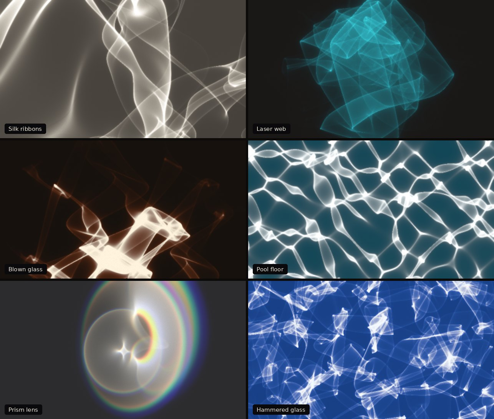

# caustic-light

Physically based caustic light for any web page: the bright webs, ribbons and
cusps that curved glass, water and polished metal throw onto a wall. One
dependency-free web component, rendered with WebGL2.



- **Real caustics, not a texture.** A grid of light rays is bent by an animated
  surface and drawn where it lands, so folds and cusps come out as crisp, moving
  lines.
- **Six presets** (silk ribbons, laser web, blown glass, pool floor, prism lens,
  hammered glass) and every parameter exposed as an HTML attribute.
- **Fits into any page:** a solid wall colour, or `background="transparent"` to
  lay the light over existing content.
- **Gradient maps, spectral dispersion, round or diverging beams, glow and film
  grain.**
- **Optional hover effects:** ripple, lens, calm, swirl, focus, tilt and glow.
- **Optional music:** an endlessly looping track whose dynamics gently move the
  light.
- **Considerate by default:** pauses offscreen, scales quality to the device and
  holds still under `prefers-reduced-motion`.

## Install

From npm:

```bash
npm install caustic-light
```

```js
import 'caustic-light';            // registers <caustic-light>
```

From a CDN, with no build step:

```html
<script src="https://cdn.jsdelivr.net/npm/caustic-light@1/dist/caustic-light.min.js"></script>
```

Or copy `dist/caustic-light.min.js` (41 KB, about 15 KB gzipped) into your project.

## Quick start

```html
<section style="position: relative; height: 70vh">
  <caustic-light preset="pool" style="position: absolute; inset: 0"></caustic-light>
  <h1 style="position: relative">Hello, light.</h1>
</section>
```

The element is `display: block` and has no height of its own. Size it like any
block: with `height`, `aspect-ratio`, or `position: absolute; inset: 0` inside a
positioned parent.

To lay light over existing content instead of filling a wall, make it
transparent. It then draws light only and blends with `mix-blend-mode: screen`.
Add `pointer-events: none` so the content underneath stays clickable; hover
effects still work.

```html
<div class="card" style="position: relative">
  
  <caustic-light preset="silk" background="transparent" gradient="#b04a8a #fff2cc"
                 style="position: absolute; inset: 0; pointer-events: none"></caustic-light>
</div>
```

## Presets

| `preset` | Look | Optic |
|---|---|---|
| `silk` | Polished steel with slow dents, reflected onto a gallery wall | flow · mirror |
| `laser` | A 488 nm beam through a hammered glass sphere, spread across a wall | hammered · glass |
| `blown-glass` | A warm lamp shining up through an uneven glass shell | flow · glass · gradient |
| `pool` | Sunlight through rippling water onto the floor of a pool | ripple · water |
| `prism` | A thick glass bowl focusing sunlight, split into colour at the folds | lens · glass · dispersion |
| `hammered` | Thick dimpled glass throwing a net onto a blue table | hammered · glass · gradient |

A preset fills in every option. Any attribute you add overrides it:

```html
<caustic-light preset="laser" color="#ff3b5c" distance="3"></caustic-light>
```

## Attributes

Every attribute is optional. Option keys in JavaScript use camelCase (`beam-x`
becomes `beamX`).

### Optic

| Attribute | Range | Default | What it does |
|---|---|---|---|
| `preset` | see above | – | Starting point for every other option |
| `surface` | `flow` `ripple` `hammered` `lens` | `flow` | Shape of the bumpy optic the light passes through |
| `mode` | `reflect` `refract` | `reflect` | A mirror, or glass and water |
| `ior` | 1–2.5 | 1.5 | Refractive index in `refract` mode (water 1.333, glass 1.5) |
| `distance` | 0–6 | 1.2 | Throw from the optic to the wall. Longer throws fold the light into sharper lines |
| `relief` | 0–1.5 | 0.35 | Surface slope: how strongly the rays bend |
| `scale` | 0.2–20 | 1.4 | Bump density |
| `detail` | 1–6 | 3 | Octaves of finer bumps |
| `roughness` | 0–1 | 0.5 | Weight of each finer octave |
| `warp` | 0–2 | 0.6 | Domain warp; turns regular waves into organic ribbons |
| `speed` | 0–3 | 0.25 | Animation speed. `0` holds still and refines to a clean image |
| `seed` | any number | 1 | Picks a different surface |

### Light

| Attribute | Range | Default | What it does |
|---|---|---|---|
| `color` | CSS colour | `#fff6e8` | Colour of the light |
| `gradient` | two CSS colours | none | Gradient map: faint light takes the first colour, the brightest folds the second. Replaces `color`; `none` turns it off |
| `gradient-mid` | 0.05–0.95 | 0.55 | Where the first gradient colour hands over to the second |
| `intensity` | 0–20 | 0.7 | Light power |
| `contrast` | 0.3–4 | 1.4 | Above 1 darkens the soft veil and lifts the bright lines |
| `dispersion` | 0–1 | 0 | Splits the light into spectral samples so folds get rainbow edges |
| `beam` | 0–3 | 0 | `0` floods the element; above 0 is the radius of a round beam, in half element heights |
| `beam-x`, `beam-y` | −1–1 | 0 | Beam centre (y points up) |
| `spread` | 0–6 | 0 | Beam divergence: fans the pattern out from the beam centre, like a lamp |

### Finish

| Attribute | Range | Default | What it does |
|---|---|---|---|
| `background` | CSS colour, `transparent` | `#1b1916` | Wall colour. `transparent` draws light only and blends with `screen` |
| `glow` | 0–3 | 0.6 | Haze around bright lines |
| `softness` | 0–6 | 1 | Blur in CSS pixels (a larger light source) |
| `trail` | 0–0.95 | 0.4 | Temporal smoothing while animating |
| `grain` | 0–0.2 | 0.03 | Film grain |
| `quality` | `auto` `low` `medium` `high` | `auto` | `auto` starts at medium (low on phones) and steps down if frames are slow |
| `paused` | boolean | off | Freezes the animation |
| `motion` | `auto` `always` | `auto` | `auto` holds still for visitors who ask for reduced motion |

### Hover effects

Off by default. Combine any of them in a space-separated list:
`hover="ripple swirl"`.

| Effect | What happens under the pointer |
|---|---|
| `ripple` | Rings spread out as the pointer moves; a click or tap drops a bigger one |
| `lens` | A soft lens follows the pointer and gathers light into a ring |
| `calm` | The optic goes still and the light relaxes into a quiet patch |
| `swirl` | The pattern twists around the pointer, more when it moves fast |
| `focus` | Lines sharpen and multiply |
| `tilt` | The light source leans toward the pointer, a gentle parallax |
| `glow` | A soft pool of extra light |

| Attribute | Range | Default | What it does |
|---|---|---|---|
| `hover` | effect list, `none` | none | Which effects respond to the pointer |
| `hover-strength` | 0–3 | 1 | Scales every hover effect |
| `hover-radius` | 0.05–1.5 | 0.35 | Size of the affected area, in half element heights (lens, calm, swirl, focus, glow) |
| `interactive` | boolean | off | Shorthand for `hover="lens"` |

Effects listen on the window, so they also work when the element has
`pointer-events: none`. Ripples are skipped under `prefers-reduced-motion`.

### Music

The light can follow a music track: louder passages brighten the light and
speed up its flow, low notes deepen the relief, and high notes add glow. Each
change is measured against the track's own running average, so quiet and loud
tracks react about the same.

```html
<caustic-light preset="blown-glass" audio="music/ambient.mp3"
               audio-react="0.6" audio-controls></caustic-light>
```

| Attribute | Range | Default | What it does |
|---|---|---|---|
| `audio` | URL | none | Music file (MP3, M4A, OGG, anything the browser decodes). It loops forever, crossfading its end into its start |
| `audio-element` | CSS selector | none | Follow an existing `<audio>` or `<video>` element instead |
| `audio-react` | 0–2 | 0.6 | How strongly the music moves the light. `0` turns the reaction off |
| `audio-volume` | 0–1 | 0.6 | Playback volume |
| `audio-crossfade` | 0–20 | 4 | Seconds of overlap at the loop point. Use about `0.5` for a file that is already a seamless loop |
| `audio-controls` | boolean | off | Shows a small play / pause button in the corner (style it with `::part(audio-button)`) |
| `audio-autoplay` | boolean | off | Starts on the visitor's first click, tap or key press |

Browsers never allow sound before the visitor interacts with the page, so music
starts from the corner button, from `audio-autoplay`, or from your own control
calling `el.playAudio()`. Music pauses while the tab is in the background.
Files on another domain must allow CORS.

Pages that use music must be served over HTTP. Opening them from disk
(`file://`) blocks the audio request. For local testing:

```bash
python3 -m http.server 8000
```

## JavaScript API

```js
const light = document.querySelector('caustic-light');

light.setOptions({ distance: 1.8, color: '#9ff' });   // merge options (they override the preset and attributes)
light.clearOptions();                                  // drop everything set through setOptions
light.preset = 'pool';                                 // same as setAttribute('preset', 'pool')
light.options;                                         // the effective options
light.pause(); light.play();
light.refresh();                                       // restart the refinement of a still image
light.ripple(0, 0, 1.5);                               // drop a ripple at element coordinates (-1..1, y up)
light.stats;                                           // { fps, rays, bands, quality }

light.playAudio(); light.pauseAudio(); light.toggleAudio();   // call these from a click or key press
light.audioPlaying;                                    // boolean
light.audioLevels;                                     // { energy, low, mid, high }, 1 = the track's average

light.addEventListener('audio-play', () => {});
light.addEventListener('audio-pause', () => {});
light.addEventListener('caustic-error', e => console.warn(e.detail));   // no WebGL 2, or the music failed

CausticLight.presets;       // the preset table, each with a label and a note
CausticLight.defaults;      // the default options
CausticLight.attributes;    // option key -> attribute name
CausticLight.version;
```

TypeScript declarations ship with the package, including
`HTMLElementTagNameMap['caustic-light']`.

### Styling

The canvas and the music button are exposed as CSS parts:

```css
caustic-light::part(canvas) { filter: saturate(1.2); }
caustic-light::part(audio-button) { right: auto; left: 16px; }
```

## crossfade-loop.js

The music engine is also available on its own, for pages that want endless
background music without the light:

```html
<script src="https://cdn.jsdelivr.net/npm/caustic-light@1/dist/crossfade-loop.min.js"></script>
<script>
  const music = new CrossfadeLoop('music/ambient.mp3', { crossfade: 8, volume: 0.5 });
  document.querySelector('#sound').addEventListener('click', () => music.toggle());
</script>
```

Options: `crossfade`, `trimStart`, `trimEnd`, `volume`, `fadeIn`, `fadeOut`,
`pauseWhenHidden`. Methods: `play()`, `pause()`, `toggle()`, `stop()`,
`setVolume(v, seconds)`, `destroy()`. With npm, `import 'caustic-light/crossfade-loop'`
defines the global `CrossfadeLoop` class.

## Making a seamless music loop

`tools/make-loop.py` turns any track into a loop that repeats without a seam. It
skips the quiet intro and the fade-out, finds an ending that matches the opening
in loudness and tone, crossfades the two, sets the loudness to −18 LUFS and
writes WAV, MP3, M4A and OGG copies. It also writes a 40-second clip across the
loop point so you can check the join by ear. It needs Python 3, numpy and ffmpeg.

```bash
python3 tools/make-loop.py track.mp3 --out loops/
# then: <caustic-light audio="loops/track-loop.mp3" audio-crossfade="0.5">
```

## Examples

Try the [live playground](https://sachaa.github.io/caustic-light/) or browse
the [examples](https://sachaa.github.io/caustic-light/examples/). The
`.github/workflows/pages.yml` workflow publishes them to GitHub Pages on every
push to the default branch.

The `examples` folder has a gallery, a preset switcher, light over page content,
the hover effects, music-reactive light and the full playground. Serve the
repository root and open the gallery:

```bash
npm start                      # python3 -m http.server 8000
# open http://localhost:8000/examples/
```

## Browser support

Current Chrome, Edge, Firefox and Safari (desktop and mobile) with WebGL 2.
Float render targets (`EXT_color_buffer_float`) give the best result. Without
them the component falls back to 8-bit buffers. Without WebGL 2 the element
shows its background colour and fires `caustic-error`.

Each element uses its own WebGL context, and browsers cap the number of live
contexts at around 16 per page, so keep the count modest.

## How it works

Each frame, a grid of a few hundred thousand rays per spectral sample leaves a
light source and meets an animated height field. The
rays are reflected or refracted by the local slope and travel the throw
`distance` to the wall. Each grid triangle is drawn where its rays land with
brightness equal to the area it started with divided by the area it covers now,
so light is conserved: where the grid is squeezed, light piles up into bright
folds. Strongly folded parts of the grid are drawn as small photons stretched
along the fold instead, which keeps the brightest lines free of sparkle. The
result is accumulated over frames, then blurred, given glow, contrast and tone
mapping, and composited over the background.

## Contributing

See [CONTRIBUTING.md](CONTRIBUTING.md). Run `npm start` and open the playground
to try changes.

## License

The code is released under the [MIT License](LICENSE). © 2026 Sacha.

The demo track `examples/assets/ambient-loop.mp3` was generated with ElevenLabs
Music and is **not** covered by the MIT license. See
[examples/assets/AUDIO-LICENSE.md](examples/assets/AUDIO-LICENSE.md). It is
not part of the npm package.
